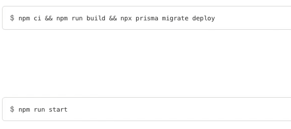

npm init -y

npm install -D typescript @types/node tsx tsup

npx tsc --init
<!-- Muda para es2020 -->

npm i fastify

npm i prisma -D

npm i @prima/client

npx prisma init

npx prisma migrate dev

//create users

npx prisma studio

npm i zod

No meu vou instalar:
npm install express @types/express

no meu vou instalar o sentry tbm:
npm install @sentry/node
npm install @sentry/tracing
npm install -D @types/sentry__node

instalei o prettier tbm

instalando lint
npm install --save-dev eslint
